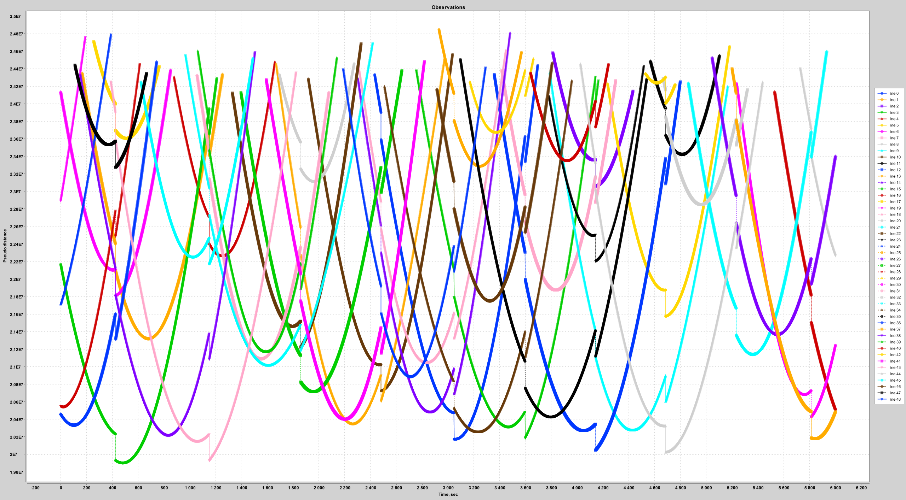

# OCTAVA
==============
This open source project is a demo of original SDK "OCTAVA" for GNSS observation processing (see details http://www.kharkovgnssgroup.net/en/projects/sdk-octava.html)
Original project written on the MatLab (Matrix Laboratory) programming support environment snd still under development.
Those project is being developed in spare time.

## Used Technologies
- Java 8
- Spring MVC, Spring AOP
- Amazon S3
- Hibernate
- Jama (Matrix tool)
- XChart
- JMockito
- JUnit 5
- log4j
- Lombok
- JSP

## Whole project is splitted on several packages (modules):
### - config - Spring / Spring MVC, Hibernate etc settings;
### - business - module for user interaction purposes;
### - ppa - module for Pre Proccesing Algorithms implementation;
### - utils - common tool set for modules.

# 1) Get Started

### 1.1 Start Tomcat
##### If Tomcat encountered an error for JDBC driver leaking. It should be ignored by Fine server settings

### 1.2 Chose create Project -> Enter project Name (at least 4 symbols)

### 1.3 Pick up Rinex file from testResourse folder (example 38541890.16o) of current project -> press upload file
### Rinex format can be found by link ftp://igs.org/pub/data/format/rinex211.txt

### 1.4 After the file has been uploaded it will be parsed to the Object representation.

### Example for observation reading from 38541890.16o file


#### Rinex Header example

```
     2.11           OBSERVATION DATA    GPS(GPS)            RINEX VERSION / TYPE
cnvtToRINEX 2.29.0  convertToRINEX OPR  08-Jul-16 08:29 UTC PGM / RUN BY / DATE 
----------------------------------------------------------- COMMENT             
priyomniy                                                   MARKER NAME         
                                                            MARKER NUMBER       
GNSS Observer       Trimble                                 OBSERVER / AGENCY   
0220323854          5700                2.32                REC # / TYPE / VERS 
122                 TRM41249.00                             ANT # / TYPE        
  3501239.1175  2097758.3036  4884932.6689                  APPROX POSITION XYZ 
        1.5520        0.0000        0.0000                  ANTENNA: DELTA H/E/N
     1     1     0                                          WAVELENGTH FACT L1/2
     4    C1    L1    L2    P2                              # / TYPES OF OBSERV 
  2016     7     7     7    31   45.0000000     GPS         TIME OF FIRST OBS   
  2016     7     8     8    32    0.0000000     GPS         TIME OF LAST OBS    
     0                                                      RCV CLOCK OFFS APPL 
    17                                                      LEAP SECONDS        
    31                                                      # OF SATELLITES     
   G01  1264  1264  1264  1264                              PRN / # OF OBS      
   G02  1806  1806  1806  1806                              PRN / # OF OBS      
   G03  1412  1412  1412  1412                              PRN / # OF OBS      
   G05  1728  1728  1728  1728                              PRN / # OF OBS      
   G06  2009  2009  2009  2009                              PRN / # OF OBS      
   G07  1380  1380  1380  1380                              PRN / # OF OBS      
   G08  1654  1654  1654  1654                              PRN / # OF OBS      
   G09  1442  1442  1442  1442                              PRN / # OF OBS      
   G10  1306  1306  1306  1306                              PRN / # OF OBS      
   G11  1180  1180  1180  1180                              PRN / # OF OBS      
   G12  1682  1682  1682  1682                              PRN / # OF OBS      
   G13  1454  1454  1454  1454                              PRN / # OF OBS      
   G14  1656  1656  1655  1655                              PRN / # OF OBS      
   G15  1844  1844  1844  1844                              PRN / # OF OBS      
   G16  1735  1735  1735  1735                              PRN / # OF OBS      
   G17  1986  1986  1986  1986                              PRN / # OF OBS      
   G18  1364  1364  1364  1364                              PRN / # OF OBS      
   G19  1872  1872  1872  1872                              PRN / # OF OBS      
   G20  1676  1676  1676  1676                              PRN / # OF OBS      
   G21  1452  1452  1452  1452                              PRN / # OF OBS      
   G22  1452  1452  1452  1452                              PRN / # OF OBS      
   G23  1444  1444  1444  1444                              PRN / # OF OBS      
   G24  1546  1546  1546  1546                              PRN / # OF OBS      
   G25  1462  1462  1462  1462                              PRN / # OF OBS      
   G26  1682  1682  1682  1682                              PRN / # OF OBS      
   G27  1456  1456  1456  1456                              PRN / # OF OBS      
   G28  1466  1465  1463  1463                              PRN / # OF OBS      
   G29  1436  1436  1436  1436                              PRN / # OF OBS      
   G30  1412  1412  1412  1412                              PRN / # OF OBS      
   G31  1762  1762  1762  1762                              PRN / # OF OBS      
   G32  1810  1810  1810  1810                              PRN / # OF OBS      
CARRIER PHASE MEASUREMENTS: PHASE SHIFTS REMOVED            COMMENT             
                                                            END OF HEADER    
```
#### Raw data example
```
 16  7  7 16 10 15.0000000  0  9G08G10G15G16G18G20G21G26G27         
  22890668.930 6  -7440961.254 6  -5774575.20747  22890668.80147
  20789402.195 8 -17821964.480 8 -13860796.95349  20789401.87949
  23296286.609 6  -3873151.113 6  -3004963.27347  23296285.49647
  22278762.617 7  -8238517.637 7  -6395497.27047  22278759.71547
  20865743.953 7 -15684778.066 7 -12179599.62548  20865740.81648
  24096411.227 5   1829887.734 5   1449725.65646  24096408.21546
  22193367.000 7  -9364795.855 7  -7274536.84848  22193363.55148
  23835359.867 5   -995523.508 5   -751763.21946  23835363.23446
  20607215.195 7 -17817265.613 7 -13873648.27749  20607213.85949
 16  7  7 16 10 30.0000000  0  9G08G10G15G16G18G20G21G26G27         
  22882407.289 6  -7484374.828 6  -5808403.94547  22882407.13747
  20784768.953 8 -17846312.023 8 -13879769.05549  20784768.63749
  23299545.352 6  -3856028.777 6  -2991621.18447  23299543.39147
  22286362.203 7  -8198583.148 7  -6364379.51247  22286358.89547
  20868330.203 7 -15671188.313 7 -12169010.20348  20868326.36748
  24106953.711 5   1885291.273 5   1492897.23446  24106950.80946
  22199200.188 7  -9334143.645 7  -7250652.01648  22199196.62148
  23845761.680 5   -940862.875 5   -709170.55546  23845764.51246
  20604042.313 7 -17833938.324 7 -13886639.99249  20604041.37149
```